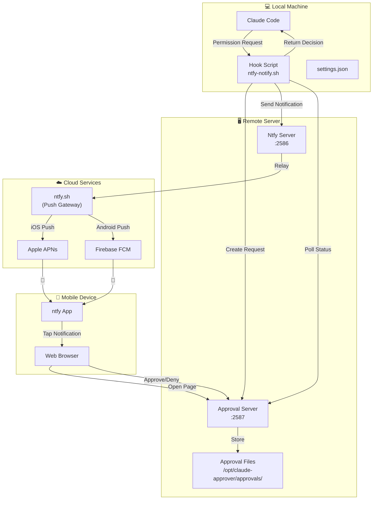
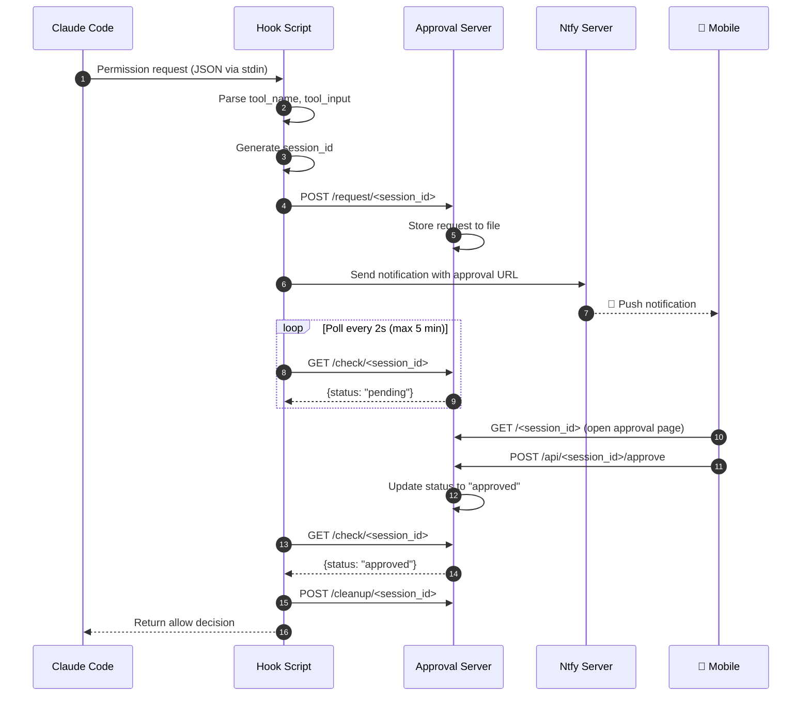
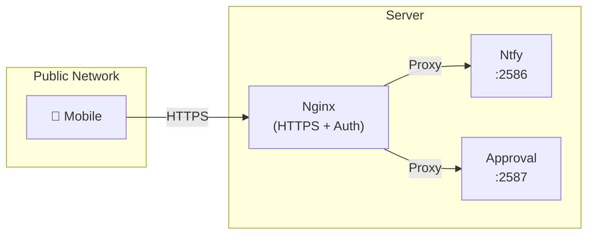

# Claude Mobile Approver - Architecture

This document describes the complete architecture of Claude Mobile Approver.

## System Overview



## Components

### 1. Local Components

#### Hook Script (`ntfy-notify.sh`)

The core component that intercepts Claude Code permission requests.

```bash
┌─────────────────────────────────────────────────────────────┐
│                      ntfy-notify.sh                         │
├─────────────────────────────────────────────────────────────┤
│  1. Read permission request from stdin                      │
│  2. Extract tool name and input parameters                  │
│  3. Create approval request on server                       │
│  4. Send push notification via ntfy                         │
│  5. Poll server for approval status                         │
│  6. Return decision to Claude Code                          │
└─────────────────────────────────────────────────────────────┘
```

**Configuration**:
```bash
NTFY_SERVER="http://YOUR_SERVER_IP:2586"
APPROVAL_SERVER="http://YOUR_SERVER_IP:2587"
NTFY_USER="your_username"
NTFY_PASS="your_password"
NTFY_TOPIC="claude-approve-your_username"
```

#### Claude Code Settings

```json
{
  "hooks": {
    "PermissionRequest": [
      {
        "matcher": ".*",
        "hooks": [
          {
            "type": "command",
            "command": "~/.claude/scripts/ntfy-notify.sh"
          }
        ]
      }
    ]
  }
}
```

### 2. Server Components

#### Ntfy Server (Port 2586)

Open-source push notification server.

```yaml
# /opt/ntfy/config/server.yml
base-url: http://YOUR_SERVER_IP:2586
auth-file: /etc/ntfy/user.db
auth-default-access: deny-all
upstream-base-url: "https://ntfy.sh"  # For iOS/Android push
```

**Features**:
- User authentication
- Topic-based messaging
- Push notification relay via ntfy.sh

#### Approval Server (Port 2587)

Flask-based web server for approval UI.

```
┌─────────────────────────────────────────────────────────────┐
│                    Approval Server                          │
├─────────────────────────────────────────────────────────────┤
│  Endpoints:                                                 │
│  ├── GET  /<session_id>        → Approval page (HTML)       │
│  ├── GET  /api/<session_id>    → Get request details (JSON) │
│  ├── POST /request/<session_id> → Create approval request   │
│  ├── POST /api/<id>/approve    → Approve request            │
│  ├── POST /api/<id>/deny       → Deny request               │
│  ├── GET  /check/<session_id>  → Check status (for polling) │
│  └── POST /cleanup/<session_id> → Clean up after response   │
└─────────────────────────────────────────────────────────────┘
```

### 3. Mobile Components

#### ntfy App

- Receives push notifications
- Displays notification with tool details
- Opens approval page on tap

#### Web Browser

- Displays approval page with request details
- Shows tool name, command/file info
- Provides Approve/Deny buttons
- Supports permission suggestions

## Data Flow

### Permission Request Flow



### Data Structures

#### Permission Request Input

```json
{
  "tool_name": "Bash",
  "tool_input": {
    "command": "ls -la"
  },
  "permission_suggestions": [
    {
      "type": "addRules",
      "rules": [
        {
          "ruleContent": "Bash:ls:*"
        }
      ]
    }
  ]
}
```

#### Approval Request

```json
{
  "status": "pending",
  "created_at": 1712345678.123,
  "tool": "Bash",
  "input": {
    "command": "ls -la"
  },
  "description": "Execute: ls -la",
  "suggestions": [...]
}
```

#### Approval Response

```json
{
  "hookSpecificOutput": {
    "hookEventName": "PermissionRequest",
    "decision": {
      "behavior": "allow"
    }
  }
}
```

## Directory Structure

```
claude-mobile-approver/
├── README.md                 # Main documentation (English)
├── README_CN.md              # Chinese documentation
├── README_JP.md              # Japanese documentation
├── ARCHITECTURE.md           # This file
├── LICENSE
│
├── client/                   # Client-side components
│   └── scripts/
│       └── ntfy-notify.sh    # Hook script for Claude Code
│
├── server/                   # Server-side components
│   ├── app.py                # Flask approval server
│   └── deploy.sh             # Deployment script
│
├── config/                   # Configuration templates
│   ├── server.env.example    # Server environment template
│   └── local.env.example     # Local environment template
│
├── docs/                     # User documentation
│   ├── server-setup.md       # Server setup guide
│   └── user-guide.md         # User configuration guide
│
└── docs-private/             # Private documentation (gitignored)
    └── users.md              # User management records
```

## Security Considerations

### Authentication

- **Ntfy Server**: Username/password authentication
- **Approval Server**: No built-in auth (relies on session ID obscurity)
- **Recommendation**: Use HTTPS + nginx reverse proxy with basic auth

### Network Security



### Recommended Production Setup

```nginx
# /etc/nginx/sites-available/claude-approver
server {
    listen 443 ssl;
    server_name your-domain.com;

    ssl_certificate /path/to/cert.pem;
    ssl_certificate_key /path/to/key.pem;

    location /ntfy/ {
        proxy_pass http://localhost:2586/;
        proxy_set_header Host $host;
    }

    location /approve/ {
        auth_basic "Approval Required";
        auth_basic_user_file /etc/nginx/.htpasswd;
        proxy_pass http://localhost:2587/;
    }
}
```

## Scalability

### Single User

```
1 Claude Code instance → 1 Server → 1 Mobile device
```

### Team (Multi-user)

```
┌─────────────────────────────────────────────────────────┐
│                      Ntfy Server                         │
│  ┌─────────┐ ┌─────────┐ ┌─────────┐                    │
│  │ claude  │ │  wang   │ │  li     │  ... (users)       │
│  │ (admin) │ │ (user)  │ │ (user)  │                    │
│  └────┬────┘ └────┬────┘ └────┬────┘                    │
│       │           │           │                          │
│       ▼           ▼           ▼                          │
│  ┌─────────┐ ┌─────────┐ ┌─────────┐                    │
│  │claude-  │ │claude-  │ │claude-  │  (topics)          │
│  │approve  │ │approve- │ │approve- │                    │
│  │         │ │wang     │ │li       │                    │
│  └─────────┘ └─────────┘ └─────────┘                    │
└─────────────────────────────────────────────────────────┘
         │            │            │
         ▼            ▼            ▼
      📱           📱           📱
    Admin        Wang         Li
```

## Error Handling

### Timeout

- Default: 5 minutes
- After timeout: Default to "allow" (configurable)
- Mobile can still approve, but hook has already returned

### Network Failure

- Hook script fails silently
- Claude Code falls back to default permission prompt

### Server Unavailable

- Hook script returns error
- Claude Code shows permission prompt in terminal

## Monitoring

### Health Checks

```bash
# Ntfy server
curl http://localhost:2586/health

# Approval server
curl http://localhost:2587/health
```

### Logs

```bash
# Ntfy logs
docker logs -f ntfy

# Approval server logs
tail -f /var/log/claude-approver.log
```

## Performance

### Latency Breakdown

| Step | Typical Time |
|------|-------------|
| Hook execution | < 100ms |
| Server request creation | < 50ms |
| Push notification delivery | 1-3s |
| Mobile response (human) | 5-30s |
| Poll detection | < 2s |
| **Total** | **10-40s** |

### Resource Usage

| Component | CPU | Memory |
|-----------|-----|--------|
| Ntfy Server | < 1% | ~50MB |
| Approval Server | < 0.1% | ~30MB |
| Hook Script | N/A | ~10MB (transient) |
