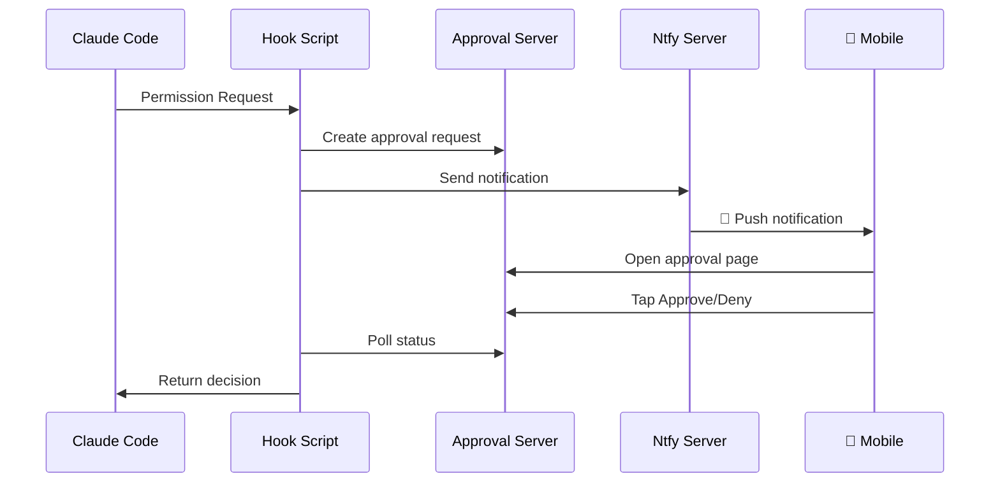

# Claude Mobile Approver

<p align="center">
  <a href="README_CN.md">中文</a> |
  <a href="README_JP.md">日本語</a>
</p>

<p align="center">
  <strong>📱 Approve Claude Code Permission Requests on Your Phone</strong>
</p>

<p align="center">
  Real-time Push Notifications · One-tap Approve/Deny · Multi-user Support · Ready to Use
</p>

<p align="center">
  
  
  
  
</p>

---

## ✨ Features

- 🔔 **Real-time Push** - Get instant notifications when Claude Code needs permission
- 👆 **One-tap Approval** - View details and approve/deny with a single tap
- 🌐 **Work Anywhere** - Respond from home, office, or on the go
- 👥 **Multi-user Support** - Team members can use independently without interference
- 🔒 **Secure & Private** - Each user has their own account with isolated permissions
- ⚡ **Fast Response** - Commands execute immediately after approval

## 🏗️ Architecture



## 🚀 Quick Start

### Prerequisites

- A Linux server (for ntfy and approval service)
- iOS or Android phone
- [Claude Code](https://claude.ai/code) installed

### 1. Server Deployment

```bash
# Create directories
mkdir -p /opt/ntfy/config /opt/ntfy/cache /opt/claude-approver/approvals

# Create ntfy config
cat > /opt/ntfy/config/server.yml << 'EOF'
base-url: http://YOUR_SERVER_IP:2586
auth-file: /etc/ntfy/user.db
auth-default-access: deny-all
upstream-base-url: "https://ntfy.sh"
EOF

# Start ntfy
docker run -d --name ntfy \
  -p 2586:80 \
  -v /opt/ntfy/config:/etc/ntfy \
  -v /opt/ntfy/cache:/var/cache/ntfy \
  binwiederhier/ntfy serve

# Create admin user
docker exec -it ntfy ntfy user add --role=admin claude
```

### 2. Deploy Approval Service

```bash
# Clone repository
git clone https://github.com/zenyrahq/claude-mobile-approver.git
cd claude-mobile-approver

# Upload to server
scp server/app.py root@YOUR_SERVER_IP:/opt/claude-approver/

# Start service
ssh root@YOUR_SERVER_IP "cd /opt/claude-approver && PORT=2587 nohup python3 app.py &"
```

### 3. Local Configuration

```bash
# Copy hook script
mkdir -p ~/.claude/scripts
cp client/scripts/ntfy-notify.sh ~/.claude/scripts/
chmod +x ~/.claude/scripts/ntfy-notify.sh

# Edit with your server details
nano ~/.claude/scripts/ntfy-notify.sh
```

### 4. Configure Claude Code

Edit `~/.claude/settings.json`:

```json
{
  "hooks": {
    "PermissionRequest": [
      {
        "matcher": ".*",
        "hooks": [
          {
            "type": "command",
            "command": "~/.claude/scripts/ntfy-notify.sh"
          }
        ]
      }
    ]
  }
}
```

### 5. Mobile App Setup

1. Install **ntfy** from App Store (iOS) or Play Store (Android)
2. Add server: `http://YOUR_SERVER_IP:2586`
3. Login with your credentials
4. Subscribe to topic: `claude-approve`

## 📖 Documentation

| Document | Description |
|----------|-------------|
| [Architecture](ARCHITECTURE.md) | System architecture and data flow |
| [Server Setup Guide](docs/server-setup.md) | Detailed server configuration |
| [User Guide](docs/user-guide.md) | Share with team members |

## 👥 Team Usage

Add new users with isolated topics:

```bash
docker exec -it ntfy ntfy user add --role=user <username>
docker exec ntfy ntfy access <username> claude-approve-<username> rw
```

## 🔧 Tech Stack

- [ntfy](https://ntfy.sh/) - Open-source push notification service
- [Flask](https://flask.palletsprojects.com/) - Lightweight web framework
- [Claude Code Hooks](https://docs.anthropic.com/claude-code/hooks) - Permission hooks

## 🤝 Contributing

Issues and Pull Requests are welcome!

## 📄 License

[MIT License](LICENSE)

---

<p align="center">
  If this project helps you, please give it a ⭐ Star
</p>
