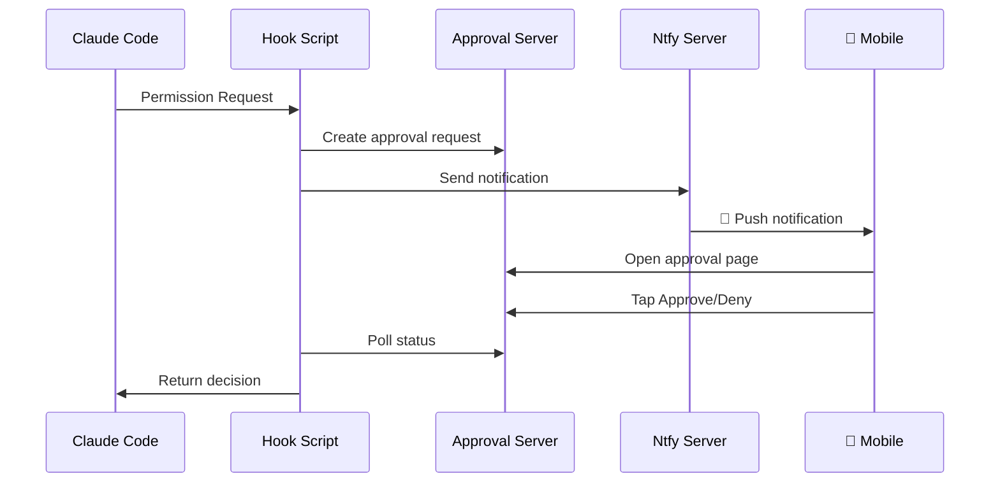
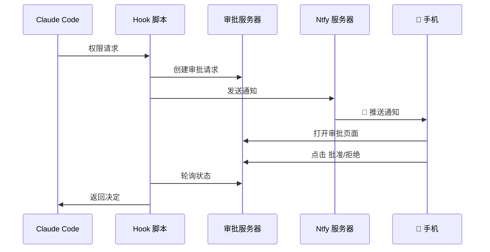
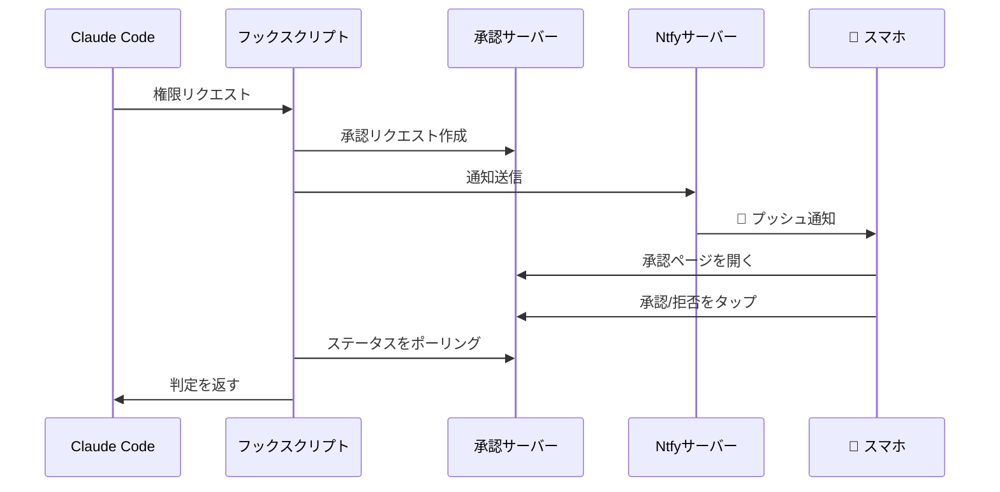

# Claude Mobile Approver

[English](#english) | [中文](#中文) | [日本語](#日本語)

---

<a name="english"></a>
## English

<p align="center">
  <strong>📱 Approve Claude Code Permission Requests on Your Phone</strong>
</p>

<p align="center">
  Real-time Push Notifications · One-tap Approve/Deny · Multi-user Support · Ready to Use
</p>

<p align="center">
  
  
  
  
</p>

---

## ✨ Features

- 🔔 **Real-time Push** - Get instant notifications when Claude Code needs permission
- 👆 **One-tap Approval** - View details and approve/deny with a single tap
- 🌐 **Work Anywhere** - Respond from home, office, or on the go
- 👥 **Multi-user Support** - Team members can use independently without interference
- 🔒 **Secure & Private** - Each user has their own account with isolated permissions
- ⚡ **Fast Response** - Commands execute immediately after approval

## 🏗️ Architecture



## 🚀 Quick Start

### Prerequisites

- A Linux server (for ntfy and approval service)
- iOS or Android phone
- [Claude Code](https://claude.ai/code) installed

### 1. Server Deployment

```bash
# Create directories
mkdir -p /opt/ntfy/config /opt/ntfy/cache /opt/claude-approver/approvals

# Create ntfy config
cat > /opt/ntfy/config/server.yml << 'EOF'
base-url: http://YOUR_SERVER_IP:2586
auth-file: /etc/ntfy/user.db
auth-default-access: deny-all
upstream-base-url: "https://ntfy.sh"
EOF

# Start ntfy
docker run -d --name ntfy \
  -p 2586:80 \
  -v /opt/ntfy/config:/etc/ntfy \
  -v /opt/ntfy/cache:/var/cache/ntfy \
  binwiederhier/ntfy serve

# Create admin user
docker exec -it ntfy ntfy user add --role=admin claude
```

### 2. Deploy Approval Service

```bash
# Clone repository
git clone https://github.com/zenyrahq/claude-mobile-approver.git
cd claude-mobile-approver

# Upload to server
scp server/app.py root@YOUR_SERVER_IP:/opt/claude-approver/

# Start service
ssh root@YOUR_SERVER_IP "cd /opt/claude-approver && PORT=2587 nohup python3 app.py &"
```

### 3. Local Configuration

```bash
# Copy hook script
mkdir -p ~/.claude/scripts
cp client/scripts/ntfy-notify.sh ~/.claude/scripts/
chmod +x ~/.claude/scripts/ntfy-notify.sh

# Edit with your server details
nano ~/.claude/scripts/ntfy-notify.sh
```

### 4. Configure Claude Code

Edit `~/.claude/settings.json`:

```json
{
  "hooks": {
    "PermissionRequest": [
      {
        "matcher": ".*",
        "hooks": [
          {
            "type": "command",
            "command": "~/.claude/scripts/ntfy-notify.sh"
          }
        ]
      }
    ]
  }
}
```

### 5. Mobile App Setup

1. Install **ntfy** from App Store (iOS) or Play Store (Android)
2. Add server: `http://YOUR_SERVER_IP:2586`
3. Login with your credentials
4. Subscribe to topic: `claude-approve`

## 📖 Documentation

| Document | Description |
|----------|-------------|
| [Server Setup Guide](docs/server-setup.md) | Detailed server configuration |
| [User Guide](docs/user-guide.md) | Share with team members |

## 👥 Team Usage

Add new users with isolated topics:

```bash
docker exec -it ntfy ntfy user add --role=user <username>
docker exec ntfy ntfy access <username> claude-approve-<username> rw
```

## 🔧 Tech Stack

- [ntfy](https://ntfy.sh/) - Open-source push notification service
- [Flask](https://flask.palletsprojects.com/) - Lightweight web framework
- [Claude Code Hooks](https://docs.anthropic.com/claude-code/hooks) - Permission hooks

## 🤝 Contributing

Issues and Pull Requests are welcome!

## 📄 License

[MIT License](LICENSE)

---

<a name="中文"></a>
## 中文

<p align="center">
  <strong>📱 在手机上审批 Claude Code 的权限请求</strong>
</p>

<p align="center">
  实时推送通知 · 一键批准/拒绝 · 支持多用户 · 开箱即用
</p>

---

## ✨ 功能特性

- 🔔 **实时推送** - 当 Claude Code 需要权限时，手机立即收到通知
- 👆 **一键审批** - 在手机上查看详情，一键批准或拒绝
- 🌐 **随处可用** - 无论在公司、家里还是路上，都能响应
- 👥 **多用户支持** - 支持团队成员独立使用，互不干扰
- 🔒 **安全可控** - 每个用户独立账号，权限隔离
- ⚡ **快速响应** - 批准后命令立即执行，无需等待

## 🏗️ 架构



## 🚀 快速开始

### 前置条件

- 一台 Linux 服务器（用于部署 ntfy 和审批服务）
- iOS 或 Android 手机
- 已安装 [Claude Code](https://claude.ai/code)

### 1. 服务器部署

```bash
# 创建目录
mkdir -p /opt/ntfy/config /opt/ntfy/cache /opt/claude-approver/approvals

# 创建 ntfy 配置
cat > /opt/ntfy/config/server.yml << 'EOF'
base-url: http://YOUR_SERVER_IP:2586
auth-file: /etc/ntfy/user.db
auth-default-access: deny-all
upstream-base-url: "https://ntfy.sh"
EOF

# 启动 ntfy
docker run -d --name ntfy \
  -p 2586:80 \
  -v /opt/ntfy/config:/etc/ntfy \
  -v /opt/ntfy/cache:/var/cache/ntfy \
  binwiederhier/ntfy serve

# 创建管理员
docker exec -it ntfy ntfy user add --role=admin claude
```

### 2. 部署审批服务

```bash
# 克隆仓库
git clone https://github.com/zenyrahq/claude-mobile-approver.git
cd claude-mobile-approver

# 上传到服务器
scp server/app.py root@YOUR_SERVER_IP:/opt/claude-approver/

# 启动服务
ssh root@YOUR_SERVER_IP "cd /opt/claude-approver && PORT=2587 nohup python3 app.py &"
```

### 3. 本地配置

```bash
# 复制 hook 脚本
mkdir -p ~/.claude/scripts
cp client/scripts/ntfy-notify.sh ~/.claude/scripts/
chmod +x ~/.claude/scripts/ntfy-notify.sh

# 编辑脚本，填入你的服务器信息
nano ~/.claude/scripts/ntfy-notify.sh
```

### 4. 配置 Claude Code

编辑 `~/.claude/settings.json`：

```json
{
  "hooks": {
    "PermissionRequest": [
      {
        "matcher": ".*",
        "hooks": [
          {
            "type": "command",
            "command": "~/.claude/scripts/ntfy-notify.sh"
          }
        ]
      }
    ]
  }
}
```

### 5. 手机配置

1. 在 App Store / Play 商店安装 **ntfy** 应用
2. 添加服务器：`http://YOUR_SERVER_IP:2586`
3. 登录你的账号
4. 订阅 topic：`claude-approve`

## 📖 文档

| 文档 | 说明 |
|-----|------|
| [服务器部署指南](docs/server-setup.md) | 详细的服务器配置说明 |
| [用户配置指南](docs/user-guide.md) | 分享给团队成员的配置文档 |

## 👥 团队使用

支持多用户独立使用：

```bash
docker exec -it ntfy ntfy user add --role=user <用户名>
docker exec ntfy ntfy access <用户名> claude-approve-<用户名> rw
```

每个用户使用独立的 topic，互不干扰。

## 🔧 技术栈

- [ntfy](https://ntfy.sh/) - 开源推送通知服务
- [Flask](https://flask.palletsprojects.com/) - 轻量级 Web 框架
- [Claude Code Hooks](https://docs.anthropic.com/claude-code/hooks) - Claude Code 权限钩子

## 🤝 贡献

欢迎提交 Issue 和 Pull Request！

## 📄 许可证

[MIT License](LICENSE)

---

<p align="center">
  如果这个项目对你有帮助，请给一个 ⭐ Star
</p>

---

<a name="日本語"></a>
## 日本語

<p align="center">
  <strong>📱 スマホでClaude Codeの権限リクエストを承認</strong>
</p>

<p align="center">
  リアルタイムプッシュ通知 · ワンタップ承認/拒否 · マルチユーザー対応 · すぐに使える
</p>

---

## ✨ 機能

- 🔔 **リアルタイムプッシュ** - Claude Codeが権限を必要とする際、すぐに通知を受信
- 👆 **ワンタップ承認** - 詳細を確認し、ワンタップで承認/拒否
- 🌐 **どこでも利用可能** - オフィス、自宅、移動中どこからでも対応
- 👥 **マルチユーザー対応** - チームメンバーが独立して使用可能、干渉なし
- 🔒 **安全でプライベート** - 各ユーザーが独立したアカウントと分離された権限を持つ
- ⚡ **高速レスポンス** - 承認後、コマンドが即座に実行

## 🏗️ アーキテクチャ



## 🚀 クイックスタート

### 前提条件

- Linuxサーバー（ntfyと承認サービス用）
- iOSまたはAndroidスマートフォン
- [Claude Code](https://claude.ai/code)がインストール済み

### 1. サーバーデプロイ

```bash
# ディレクトリ作成
mkdir -p /opt/ntfy/config /opt/ntfy/cache /opt/claude-approver/approvals

# ntfy設定作成
cat > /opt/ntfy/config/server.yml << 'EOF'
base-url: http://YOUR_SERVER_IP:2586
auth-file: /etc/ntfy/user.db
auth-default-access: deny-all
upstream-base-url: "https://ntfy.sh"
EOF

# ntfy起動
docker run -d --name ntfy \
  -p 2586:80 \
  -v /opt/ntfy/config:/etc/ntfy \
  -v /opt/ntfy/cache:/var/cache/ntfy \
  binwiederhier/ntfy serve

# 管理者ユーザー作成
docker exec -it ntfy ntfy user add --role=admin claude
```

### 2. 承認サービスのデプロイ

```bash
# リポジトリをクローン
git clone https://github.com/zenyrahq/claude-mobile-approver.git
cd claude-mobile-approver

# サーバーにアップロード
scp server/app.py root@YOUR_SERVER_IP:/opt/claude-approver/

# サービス起動
ssh root@YOUR_SERVER_IP "cd /opt/claude-approver && PORT=2587 nohup python3 app.py &"
```

### 3. ローカル設定

```bash
# フックスクリプトをコピー
mkdir -p ~/.claude/scripts
cp client/scripts/ntfy-notify.sh ~/.claude/scripts/
chmod +x ~/.claude/scripts/ntfy-notify.sh

# サーバー情報を編集
nano ~/.claude/scripts/ntfy-notify.sh
```

### 4. Claude Codeの設定

`~/.claude/settings.json`を編集：

```json
{
  "hooks": {
    "PermissionRequest": [
      {
        "matcher": ".*",
        "hooks": [
          {
            "type": "command",
            "command": "~/.claude/scripts/ntfy-notify.sh"
          }
        ]
      }
    ]
  }
}
```

### 5. モバイルアプリの設定

1. App Store / Play Storeで**ntfy**をインストール
2. サーバーを追加：`http://YOUR_SERVER_IP:2586`
3. 認証情報でログイン
4. トピックを購読：`claude-approve`

## 📖 ドキュメント

| ドキュメント | 説明 |
|------------|------|
| [サーバーセットアップガイド](docs/server-setup.md) | 詳細なサーバー設定 |
| [ユーザーガイド](docs/user-guide.md) | チームメンバー用 |

## 👥 チーム利用

分離されたトピックで新規ユーザーを追加：

```bash
docker exec -it ntfy ntfy user add --role=user <ユーザー名>
docker exec ntfy ntfy access <ユーザー名> claude-approve-<ユーザー名> rw
```

各ユーザーは独立したトピックを使用し、相互に干渉しません。

## 🔧 技術スタック

- [ntfy](https://ntfy.sh/) - オープンソースプッシュ通知サービス
- [Flask](https://flask.palletsprojects.com/) - 軽量Webフレームワーク
- [Claude Code Hooks](https://docs.anthropic.com/claude-code/hooks) - 権限フック

## 🤝 コントリビュート

IssueやPull Requestを歓迎します！

## 📄 ライセンス

[MIT License](LICENSE)

---

<p align="center">
  このプロジェクトが役立ったら、⭐ Starをお願いします
</p>
