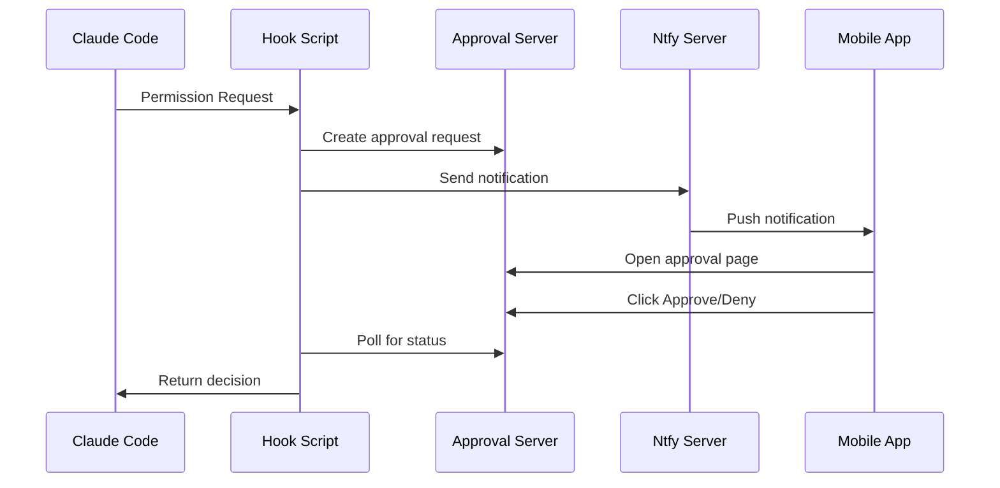

# Claude Mobile Approver

Enable mobile approval for Claude Code permission requests via ntfy push notifications.

## Features

- 📱 Real-time push notifications when Claude Code needs approval
- ✅ One-tap approval from mobile device
- 🔒 Secure authentication with username/password
- 🌐 Beautiful approval web page with detailed tool information
- 📋 Support for permission suggestions (always allow, auto mode, etc.)
- ⚡ Fast response - commands execute immediately after approval

## Architecture



## Quick Start

### 1. Server Setup

```bash
# Clone repository
git clone <repository-url> claude-mobile-approver
cd claude-mobile-approver

# Copy and edit configuration
cp config/server.env.example config/server.env
# Edit config/server.env with your settings

# Deploy to server (run on your server)
./server/deploy.sh
```

### 2. Client Setup

```bash
# Copy configuration
cp client/config/settings.example.json ~/.claude/scripts/settings.json
# Edit with your server details

# Install hook script
cp client/scripts/ntfy-notify.sh ~/.claude/scripts/
chmod +x ~/.claude/scripts/ntfy-notify.sh
```

### 3. Claude Code Configuration

Add to `~/.claude/settings.json`:

```json
{
  "hooks": {
    "PermissionRequest": [
      {
        "matcher": ".*",
        "hooks": [
          {"type": "command", "command": "~/.claude/scripts/ntfy-notify.sh"}
        ]
      }
    ]
  }
}
```

### 4. Mobile App Setup

1. Install ntfy app (iOS/Android)
2. Add server: `http://YOUR_SERVER_IP:2586`
3. Subscribe to topic: `claude-approve`
4. Login with credentials from `config/server.env`

## Documentation

- [Setup Guide](../sigmaDoc/guides/claude-approver-setup.md) - Detailed installation instructions
- [Architecture](../sigmaDoc/design/claude-approver-architecture.md) - Technical details

## Security Notes

- Never commit `config/local.env` or `config/server.env` to git
- Use strong passwords for ntfy authentication
- Consider using HTTPS in production (nginx reverse proxy)
- Review firewall rules for ports 2586 and 2587

## License

MIT License
