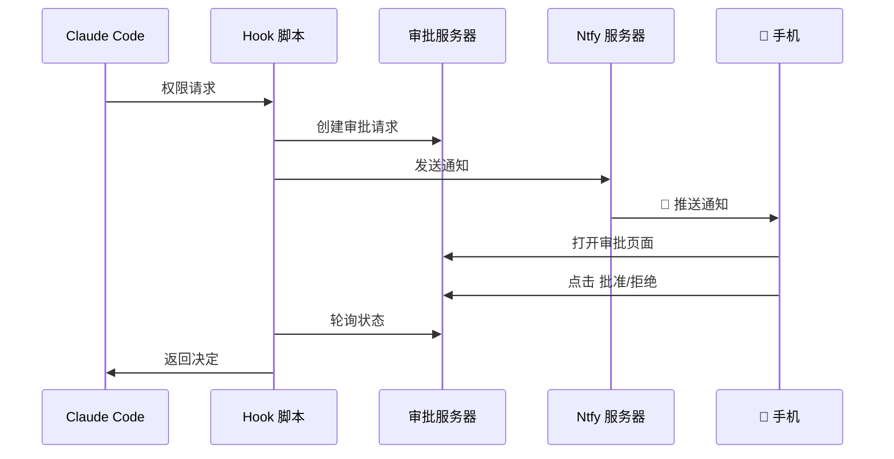

# Claude Mobile Approver

[English](README_EN.md) | [中文](README_CN.md) | [日本語](README_JP.md)

<p align="center">
  <strong>📱 在手机上审批 Claude Code 的权限请求</strong>
</p>

<p align="center">
  实时推送通知 · 一键批准/拒绝 · 支持多用户 · 开箱即用
</p>

<p align="center">
  
  
  
  
</p>

---

## ✨ 功能特性

- 🔔 **实时推送** - 当 Claude Code 需要权限时，手机立即收到通知
- 👆 **一键审批** - 在手机上查看详情，一键批准或拒绝
- 🌐 **随处可用** - 无论在公司、家里还是路上，都能响应
- 👥 **多用户支持** - 支持团队成员独立使用，互不干扰
- 🔒 **安全可控** - 每个用户独立账号，权限隔离
- ⚡ **快速响应** - 批准后命令立即执行，无需等待

## 🏗️ 架构



## 🚀 快速开始

### 前置条件

- 一台 Linux 服务器（用于部署 ntfy 和审批服务）
- iOS 或 Android 手机
- 已安装 [Claude Code](https://claude.ai/code)

### 1. 服务器部署

```bash
# 创建目录
mkdir -p /opt/ntfy/config /opt/ntfy/cache /opt/claude-approver/approvals

# 创建 ntfy 配置
cat > /opt/ntfy/config/server.yml << 'EOF'
base-url: http://YOUR_SERVER_IP:2586
auth-file: /etc/ntfy/user.db
auth-default-access: deny-all
upstream-base-url: "https://ntfy.sh"
EOF

# 启动 ntfy
docker run -d --name ntfy \
  -p 2586:80 \
  -v /opt/ntfy/config:/etc/ntfy \
  -v /opt/ntfy/cache:/var/cache/ntfy \
  binwiederhier/ntfy serve

# 创建管理员
docker exec -it ntfy ntfy user add --role=admin claude
```

### 2. 部署审批服务

```bash
# 克隆仓库
git clone https://github.com/zenyrahq/claude-mobile-approver.git
cd claude-mobile-approver

# 上传到服务器
scp server/app.py root@YOUR_SERVER_IP:/opt/claude-approver/

# 启动服务
ssh root@YOUR_SERVER_IP "cd /opt/claude-approver && PORT=2587 nohup python3 app.py &"
```

### 3. 本地配置

```bash
# 复制 hook 脚本
mkdir -p ~/.claude/scripts
cp client/scripts/ntfy-notify.sh ~/.claude/scripts/
chmod +x ~/.claude/scripts/ntfy-notify.sh

# 编辑脚本，填入你的服务器信息
nano ~/.claude/scripts/ntfy-notify.sh
```

### 4. 配置 Claude Code

编辑 `~/.claude/settings.json`：

```json
{
  "hooks": {
    "PermissionRequest": [
      {
        "matcher": ".*",
        "hooks": [
          {
            "type": "command",
            "command": "~/.claude/scripts/ntfy-notify.sh"
          }
        ]
      }
    ]
  }
}
```

### 5. 手机配置

1. 在 App Store / Play 商店安装 **ntfy** 应用
2. 添加服务器：`http://YOUR_SERVER_IP:2586`
3. 登录你的账号
4. 订阅 topic：`claude-approve`

## 📖 文档

| 文档 | 说明 |
|-----|------|
| [服务器部署指南](docs/server-setup.md) | 详细的服务器配置说明 |
| [用户配置指南](docs/user-guide.md) | 分享给团队成员的配置文档 |

## 👥 团队使用

支持多用户独立使用：

```bash
docker exec -it ntfy ntfy user add --role=user <用户名>
docker exec ntfy ntfy access <用户名> claude-approve-<用户名> rw
```

每个用户使用独立的 topic，互不干扰。

## 🔧 技术栈

- [ntfy](https://ntfy.sh/) - 开源推送通知服务
- [Flask](https://flask.palletsprojects.com/) - 轻量级 Web 框架
- [Claude Code Hooks](https://docs.anthropic.com/claude-code/hooks) - Claude Code 权限钩子

## 🤝 贡献

欢迎提交 Issue 和 Pull Request！

## 📄 许可证

[MIT License](LICENSE)

---

<p align="center">
  如果这个项目对你有帮助，请给一个 ⭐ Star
</p>
