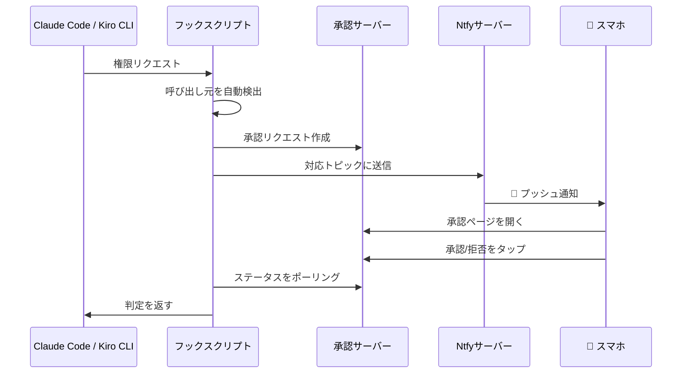

# Claude Mobile Approver

[English](README_EN.md) | [中文](README_CN.md) | [日本語](README_JP.md)

<p align="center">
  <strong>📱 スマホでClaude Code / Kiro CLIの権限リクエストを承認</strong>
</p>

<p align="center">
  リアルタイムプッシュ通知 · ワンタップ承認/拒否 · マルチユーザー対応 · すぐに使える
</p>

<p align="center">
  
  
  
  
  
</p>

---

## ✨ 機能

- 🔔 **リアルタイムプッシュ** - Claude Code / Kiro CLIが権限を必要とする際、すぐに通知を受信
- 👆 **ワンタップ承認** - 詳細を確認し、ワンタップで承認/拒否
- 🌐 **どこでも利用可能** - オフィス、自宅、移動中どこからでも対応
- 👥 **マルチユーザー対応** - チームメンバーが独立して使用可能、干渉なし
- 🔒 **安全でプライベート** - 各ユーザーが独立したアカウントと分離された権限を持つ
- ⚡ **高速レスポンス** - 承認後、コマンドが即座に実行

## 🏗️ アーキテクチャ



## 🚀 クイックスタート

### 前提条件

- Linuxサーバー（ntfyと承認サービス用）
- iOSまたはAndroidスマートフォン
- [Claude Code](https://claude.ai/code)および/または[Kiro CLI](https://kiro.dev)がインストール済み

### 1. サーバーデプロイ

```bash
# ディレクトリ作成
mkdir -p /opt/ntfy/config /opt/ntfy/cache /opt/claude-approver/approvals

# ntfy設定作成
cat > /opt/ntfy/config/server.yml << 'EOF'
base-url: http://YOUR_SERVER_IP:2586
auth-file: /etc/ntfy/user.db
auth-default-access: deny-all
upstream-base-url: "https://ntfy.sh"
EOF

# ntfy起動
docker run -d --name ntfy \
  -p 2586:80 \
  -v /opt/ntfy/config:/etc/ntfy \
  -v /opt/ntfy/cache:/var/cache/ntfy \
  binwiederhier/ntfy serve

# 管理者ユーザー作成
docker exec -it ntfy ntfy user add --role=admin claude

# Web Pushキー生成（iOSプッシュ通知に必須）
docker exec ntfy ntfy webpush keys
# 生成されたキーを /opt/ntfy/config/server.yml に追加：
# web-push-public-key: YOUR_PUBLIC_KEY
# web-push-private-key: YOUR_PRIVATE_KEY
# web-push-file: /var/cache/ntfy/webpush.db
# web-push-email-address: your-email@example.com

# ntfy再起動してWeb Push設定を適用
docker restart ntfy
```

### 2. 承認サービスのデプロイ

```bash
# リポジトリをクローン
git clone https://github.com/zenyrahq/claude-mobile-approver.git
cd claude-mobile-approver

# サーバーにアップロード
scp server/app.py root@YOUR_SERVER_IP:/opt/claude-approver/

# サービス起動
ssh root@YOUR_SERVER_IP "cd /opt/claude-approver && PORT=2587 nohup python3 app.py &"
```

### 3. ローカル設定

```bash
# フックスクリプトと設定をコピー
mkdir -p ~/.claude/scripts ~/.claude/config
cp client/scripts/ntfy-notify.sh ~/.claude/scripts/
cp client/config/settings.example.json ~/.claude/config/settings.json
chmod +x ~/.claude/scripts/ntfy-notify.sh

# サーバー情報を編集
nano ~/.claude/config/settings.json
```

### 4a. Claude Codeの設定

`~/.claude/settings.json`を編集：

```json
{
  "hooks": {
    "PermissionRequest": [
      {
        "matcher": ".*",
        "hooks": [
          {
            "type": "command",
            "command": "~/.claude/scripts/ntfy-notify.sh"
          }
        ]
      }
    ]
  }
}
```

### 4b. Kiro CLIの設定

エージェント設定をコピー：

```bash
mkdir -p ~/.kiro/agents
cp client/config/kiro-agent.example.json ~/.kiro/agents/mobile-approver.json
```

Kiro CLIでエージェントを切り替え：

```
/agent swap mobile-approver
```

### 5. モバイルアプリの設定

1. App Store / Play Storeで**ntfy**をインストール
2. サーバーを追加：`http://YOUR_SERVER_IP:2586`
3. 認証情報でログイン
4. トピックを購読：
   - `claude-approve`（Claude Code用）
   - `kiro-approve`（Kiro CLI用）

## 📖 ドキュメント

| ドキュメント | 説明 |
|------------|------|
| [サーバーセットアップガイド](docs/server-setup.md) | 詳細なサーバー設定 |
| [ユーザーガイド](docs/user-guide.md) | チームメンバー用 |

## 👥 チーム利用

分離されたトピックで新規ユーザーを追加：

```bash
docker exec -it ntfy ntfy user add --role=user <ユーザー名>
docker exec ntfy ntfy access <ユーザー名> claude-approve-<ユーザー名> rw
```

各ユーザーは独立したトピックを使用し、相互に干渉しません。

## 🔧 技術スタック

- [ntfy](https://ntfy.sh/) - オープンソースプッシュ通知サービス
- [Flask](https://flask.palletsprojects.com/) - 軽量Webフレームワーク
- [Claude Code Hooks](https://docs.anthropic.com/claude-code/hooks) - 権限フック
- [Kiro CLI Hooks](https://kiro.dev/docs/cli/hooks/) - Kiro CLIフック

## 🤝 コントリビュート

IssueやPull Requestを歓迎します！

## 📄 ライセンス

[MIT License](LICENSE)

---

<p align="center">
  このプロジェクトが役立ったら、⭐ Starをお願いします
</p>
